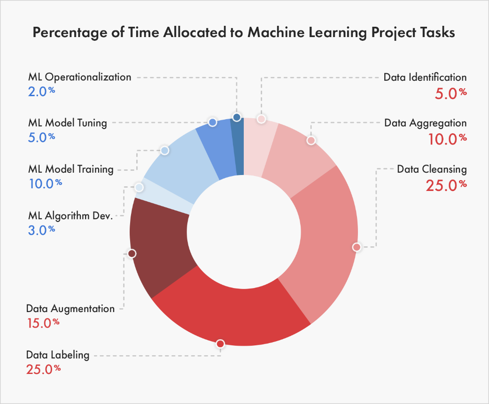
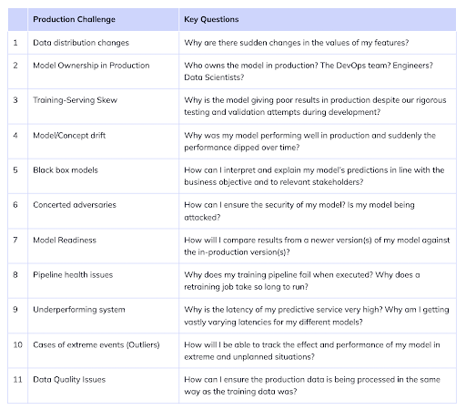

In the [last essay](https://www.shreya-shankar.com/rethinking-ml-monitoring-1/) of the Modern ML Monitoring Mess series, I discussed some ways that existing streaming ML metrics fail. In this essay, I transition from a "data-centric" perspective to a software engineering perspective: I survey existing post-deployment issues and categorize them to motivate better open-source ML monitoring tools. 

## How do we Spend Our Time as ML Practitioners?

Recently, Zillow made the rounds on social media for their latest ML disaster. Some claim their ML home-buying-and-reselling program shut down due to [low-quality predictions](https://www.geekwire.com/2021/ibuying-algorithms-failed-zillow-says-business-worlds-love-affair-ai/). Others argue it shut down because there were no organizational processes on how to act on predictions -- [employees manually overrode predictions to meet their own quotas](https://www.teamblind.com/post/Did-Zillow-fail-miserably-due-to-forcing-application-of-Machine-Learning-o8fCCZCD). Who knows what the issue(s) is/were, but I think a large reason for why the Zillow news became very popular is because **many ML applications we work on are held precariously in production**. We don’t know if or when they will fail. We don't know, organizationally, how to act on model outputs. And we definitely don't know what to do when we suspect some failure in either the ML pipelines or management. 

To dissect how to improve the distressing state of applied ML, I think it’s important to understand how ML practitioners currently spend their time. After searching far and wide, I found a pretty accurate breakdown (in my opinion) of how industry ML projects allocate time in a post on [why 87% of machine learning projects fail](https://iiot-world.com/industrial-iot/connected-industry/why-85-of-machine-learning-projects-fail/)[^1]:

*Figure 1: Chart breaking down time allocation for ML projects, taken from [iiot-world](https://iiot-world.com/industrial-iot/connected-industry/why-85-of-machine-learning-projects-fail/).*

Figure 1 obviously explains why data labeling startups are [currently](https://fortune.com/2020/02/04/artificial-intelligence-data-labeling-labelbox/) [winning](https://fortune.com/2021/08/09/snorkel-ai-funding-data-labeling-startup/) [the](https://venturebeat.com/2021/12/07/data-labeling-will-fuel-the-ai-revolution/) [MLOps](https://searchenterpriseai.techtarget.com/news/252509086/Women-led-data-labeling-AI-startup-raises-70M-in-Series-B) [market](https://techcrunch.com/2021/05/18/for-companies-that-use-ml-labeled-data-is-the-key-differentiator/), but I’m more interested in how the breakdown will change as fewer ML projects fail. As it is in software, I suspect most of the chart’s mass to be in Operationalization over the next 5 years. **How do we remove mass from data-ing and put more mass on monitoring?**

### Building an ML Pipeline

The breakdown shown in the chart above feels accurate for failing ML projects. Towards the end of my tenure at my previous ML job, we ended up following this process for building new *successful* ML pipelines:

1. Come up with the ML-specific Service Level Objective (SLO), like 90% recall over monthly windows 🪟
2. Write the functions that compute SLOs for placeholder ML pipeline outputs (e.g., baseline predicted probability) 🪠
3. Write the functions that confirm calibrated outputs ⚖️
4. Write all components, or stages, of the pipeline _except_ the model training / evaluation 🔧
5. Do careful exploratory data analysis to write pipeline components that clean data, select features, etc 📊
6. Productionize all of the above 🚧
7. Train / evaluate a logistic regression model or decision tree 🌲
8. Incrementally improve on the model 📈

The key here is that **we didn’t do any modeling until some backbone of the pipeline was in production**, eliminating time spent on data preprocessing that could be specific to a certain train/test split. However, in the paradigm I described above, we still had bugs in the data processing components in the pipeline (which, I’d argue, is inevitable). When adopting this paradigm, I noticed that most of my developer time shifted from “R&D” modeling work to monitoring production ML services.

For several months, I kept a note of the post-deployment issues I personally faced while monitoring. Missing data resulting in joins on null-valued keys, subgroup representations changing over time, promoting the wrong model to production, upstream dependencies (e.g., embeddings) changing, Spark node failures...the list is seemingly endless. Every time I faced a new issue, I tried to devise an alert to protect against that failure mode in the future. **The pipeline code then grew unsustainable, and I still faced many new challenges in production -- motivating me to think about cleaner breakdowns of post-deployment issues.**

## Categorizing Post-Deployment Issues

Suppose a team has defined a specific ML SLO for a task, like 90% recall over monthly windows. Rephrasing my question on post-deployment issues -- what are some reasons that these SLOs are not met? I like this table from a Neptune.ai [blog post](https://neptune.ai/blog/how-to-monitor-your-models-in-production-guide):

*Figure 2: Table of post-deployment issues, taken from [Neptune.ai](https://neptune.ai/blog/how-to-monitor-your-models-in-production-guide).*

To be completely honest, many of these blog posts read like laundry lists.[^2] As a lazy person, I would never manually check for every list item on every pull request. **How do we make it easier to reason about these challenges so we can build a monitoring tool?** Putting my software engineering hat on, I find it helpful to distill these production challenges (and others) into four types of problems, grouped along two axes (state and component):

<table style="border:none; table-layout: fixed">
  <tr>
   <td style="text-align:center; border:none; font-weight:bold" colspan="4" >Stateless
   </td>
  </tr>
  <tr>
   <td style="text-align:center; vertical-align:middle; border-bottom: none; font-weight:bold" rowspan="2" >Single-component
   </td>
   <td style="border-right: 2px solid black; border-bottom: 2px solid black">
<ul>

<li>Inference job failed

<li>Retraining takes too long

<li>Negative values in an obviously positive-valued feature, like age
</li>
</ul>
   </td>
   <td style="border-bottom: 2px solid black">
<ul>

<li>Online / offline code discrepancies

<li>Being responsible for successful DAG completion as the on-call engineer or data scientist

<li>Infrastructure issues (e.g., is the cluster up?)
</li>
</ul>
   </td>
   <td style="text-align:center;  vertical-align:middle; border-bottom: none; font-weight:bold" rowspan="2" >Cross-component
   </td>
  </tr>
  <tr>
   <td style="border-right: 2px solid black; border-bottom: none">
<ul>

<li>General input / output / model / concept “drift”

<li>Output distributions are different across subgroups, or “slices”
</li>
</ul>
   </td>
   <td style="border-bottom: none">
<ul>

<li>Train / serve skew

<li>Comparing end-to-end traces for different slices / subgroups

<li><strong>Tracking ML metrics in real-time (e.g., accuracy, precision, ranking performance)</strong>
</li>
</ul>
   </td>
  </tr>
  <tr>
   <td style="text-align:center; border:none; font-weight:bold" colspan="4" >Stateful
   </td>
  </tr>
</table>

*Figure 3: Categorizing a handful post-deployment problems across state and component axes.*

Let me define “state” and “component” for Figure 3 to actually make sense. Many times, you only know that there is a bug in an ML system when you compare data points to a _historical group_ of data points. For example, maybe a column in a table representing sensor data is mainly null-valued. Did the sensor just break, or has it always been broken? To answer such a question, you need to keep track of historical data, or _state_. Furthermore, you may need information from multiple different components to diagnose a failure mode in an ML system. For instance, suppose there is a discrepancy between data the model was trained on and the real-time data the model is inferring predictions for. Clearly, a debugger should care about both training and inference _components_ of ML pipelines. I define such bugs as _cross-component_ bugs. 

Understanding these axes nailed, for me, why ML monitoring was fundamentally harder than and different from traditional software monitoring. Software SLIs fall squarely into the single-component region, like average response latency. The most complex software SLIs are stateful and single-component, motivating tools like Prometheus. **But the most basic ML SLIs, such as accuracy, are stateful and cross-component -- the hardest bucket to deal with.**[^3] Once you’re able to effectively monitor such stateful cross-component metrics (e.g., real-time accuracy) to identify _when_ there are bugs, knowing stateful single-component metrics, like 90th percentile feature value, are useful because you can then identify _where_ the bug lies in your pipeline.

### Viewing Existing Tools through the State-Component Lens

I am personally interested in a completely open-source monitoring solution that tracks metrics that could lie in any of the 4 groups efficiently, quickly, and in a way that requires minimal effort from a user. Do existing tools do this? From my research, I've only found open-source monitoring tools address a subset of the 4 groups. I’ve mentally categorized existing tools into the following “levels”: 

1. Reports wrapped around `scipy.your_favorite_statistical_test(finite_sample_from_dist_A_that_you_define, finite_sample_from_dist_B_that_you_define)` --  _the user is forced to track state and component_. Here, the user needs to solve data management issues of storing historical inputs and outputs for each component they care about, write jobs to repeatedly subsample the data of interest and create these reports, and organize all artifacts in the process.
2. Workflow orchestration tools (e.g., Airflow, Argo, Kubeflow) -- _the user is forced to track state_. Here, the dashboard shows you detailed results for different tasks or components within a single pipeline run. But users can't really access values from historical runs in a current run.
3. Postgres DB that holds historical inputs and outputs to single components and a dashboard to show `np.some_aggregation(dist_A)` over time -- _the user is forced to track component_. Here, users need to know which components to monitor, manually join components’ inputs and outputs for any custom aggregations (e.g., F1-scores), and define their own criteria for how and when they will act on the dashboard results. For example, if the mean value for a feature changed by 10%, what does the user do? 
4. Proprietary vendor that monitors everything for you given access to your data and models. Not sure what these companies do, so I won’t comment.

## Recap

In this essay, I discussed how to categorize post-deployment problems across two simple axes: *state* and *component*. I don’t want to get into how to monitor for each problem I described in Figure 3, but going back to a question I posed in the [first essay of this installment](https://www.shreya-shankar.com/rethinking-ml-monitoring-1/)  -- what would it take to extend existing tools to support the stateful component and cross-component cases? Is it possible to extend them easily? In the [next essay](https://www.shreya-shankar.com/rethinking-ml-monitoring-3/), I will explore how to adapt [Prometheus](https://prometheus.io/) for monitoring ML and investigate where it breaks down. 

*Thanks to [Laszlo Sragner](https://twitter.com/xLaszlo) for feedback on early drafts.*

## Notes

[^1]: I love click-baity titles in data science blog posts. 🙃

[^2]:
     This isn’t meant to be a dig at blog post authors; it’s meant to illustrate the wide range of production ML issues. 

[^3]: It's not immediately obvious why approximating real-time metrics like accuracy is both a stateful and cross-component procedure. This is stateful because you need a set of historical predictions and labels to compute the metric over. This is cross-component because in many cases, the component that serves predictions is different from the component that collects feedback (labels).